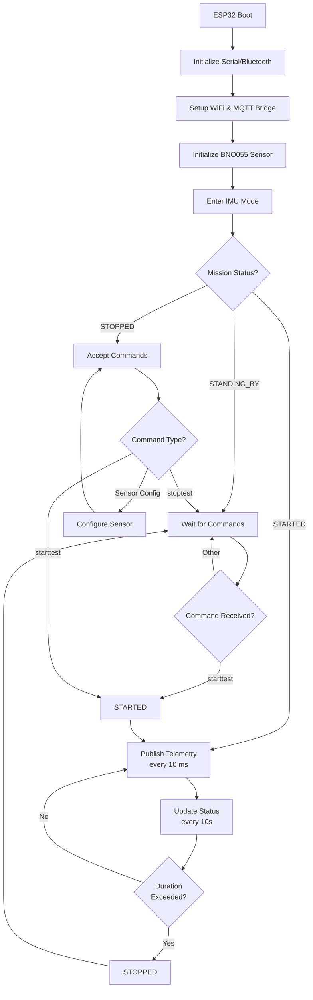

# IMU Measurements System

## Overview

This project is an ESP32-based IMU (Inertial Measurement Unit) telemetry system using the BNO055 9-axis sensor. It captures detailed motion data and streams it via MQTT to a remote telemetry server over WiFi. The system supports Bluetooth serial logging for debugging and provides remote command capabilities.

## Features

- **BNO055 Sensor Integration**: Reads acceleration, gyroscope, magnetometer, linear acceleration, gravity vector, quaternion, and Euler angles
- **MQTT Telemetry**: Real-time data streaming with configurable frequency
- **WiFi Connectivity**: Connects to a configured WiFi network
- **Bluetooth Serial Logging**: Dual-output logging via Bluetooth and USB Serial
- **Remote Command Interface**: Control sensor modes, power states, and test procedures via MQTT
- **Mission-based Testing**: Start/stop test procedures with configurable duration
- **JSON Data Format**: All sensor data serialized to JSON for easy parsing

## Hardware Requirements

- **Microcontroller**: ESP32
- **Sensor**: BNO055 9-Axis IMU
- **Communication**: I2C bus (GPIO16=SDA, GPIO17=SCL)
- **Power**: USB or 3.3V regulated power supply

## Software Components

### Libraries Used
- `Arduino.h` - Core Arduino framework
- `ArduinoJson.h` - JSON serialization library
- `BluetoothSerial.h` - Bluetooth serial communication
- BNO055 Driver (custom implementation)
- TelemetryBridge - MQTT communication layer

### Project Structure

```
src/
├── main.cpp                 # Main application logic
lib/
├── bno055_driver/          # BNO055 sensor driver
│   ├── imu.cpp/h           # IMU interface
│   ├── I2CDevice.cpp/h     # I2C communication
│   └── util/               # Helper structures (vectors, quaternions, etc.)
└── telemetry_bridge/       # MQTT telemetry module
```

## Configuration

### WiFi Settings
- SSID: `TELEMETRY`
- Password: `PASSWORD`

### MQTT Configuration
- Host: `10.79.43.181`
- Port: `1883` (standard MQTT)
- Device ID: `esp32`
- Base Topic: `imu`

### Sensor Configuration
- I2C Address: `0x28` (default BNO055)
- Default Operation Mode: `IMU_MODE`
- Default Power Mode: `NORMAL`

### Mission Parameters
- Telemetry Frequency: `100 ms` (10 Hz)
- Test Duration: `60000 ms` (60 seconds)
- Status Update Interval: `10000 ms` (10 seconds)

## Operation Modes

### Mission Status States

```
STANDING_BY (0) → STARTED (2) → STOPPED (1) → STANDING_BY
```

- **STANDING_BY**: System idle, waiting for commands
- **STARTED**: Test in progress, telemetry data being collected and transmitted
- **STOPPED**: Test paused, sensor configuration accessible

## Remote Commands

All commands use the prefix `imu:` followed by the command name.

### Mission Control
- `imu:starttest` - Begin test procedure
- `imu:stoptest` - Stop current test
- `imu:hi` - Echo test (responds with "hello")

### Sensor Configuration (only when STOPPED)
- `imu:powermode normal` - Set to NORMAL power mode
- `imu:powermode low` - Set to LOW_POWER mode
- `imu:powermode suspend` - Set to SUSPEND mode
- `imu:reset` - Reset the sensor
- `imu:selftest` - Run built-in self-test
- `imu:operationmode config` - Enter CONFIG mode (for calibration)
- `imu:operationmode imu` - Return to IMU_MODE

## Telemetry Data Format

Sensor data is published as JSON with the following structure:

```json
{
  "timestamp": 1234567890,
  "sensor": "bno055",
  "accel": {"x": 0.0, "y": 0.0, "z": 9.81},
  "mag": {"x": 0.0, "y": 0.0, "z": 0.0},
  "gyro": {"x": 0.0, "y": 0.0, "z": 0.0},
  "linearAccel": {"x": 0.0, "y": 0.0, "z": 0.0},
  "gravityVector": {"x": 0.0, "y": 0.0, "z": 0.0},
  "quaternion": {"w": 1.0, "x": 0.0, "y": 0.0, "z": 0.0},
  "euler": {"roll": 0.0, "pitch": 0.0, "yaw": 0.0}
}
```

## System Architecture



## Data Flow Diagram

```mermaid
graph LR
    Sensor["BNO055 Sensor<br/>I2C"]
    
    Driver["IMU Driver<br/>readAllData()"]
    
    Serialize["JSON Serializer<br/>serializeDataToJson()"]
    
    Bridge["Telemetry Bridge<br/>MQTT"]
    
    MQTT["MQTT Broker<br/>10.79.43.181"]
    
    CMD["MQTT Command<br/>Topic"]
    
    Handler["Command Handler<br/>onCommand()"]
    
    Sensor -->|I2C| Driver
    Driver -->|bno055_burst_t| Serialize
    Serialize -->|JSON String| Bridge
    Bridge -->|Publish| MQTT
    CMD -->|Subscribe| Handler
    Handler -->|Commands| Sensor
```



## Setup Instructions

1. **Install PlatformIO** - Open the project in VS Code with PlatformIO extension
2. **Configure Board** - Ensure `platformio.ini` targets ESP32
3. **Install Dependencies** - PlatformIO will install required libraries
4. **Connect Hardware** - Wire BNO055 to ESP32 I2C pins (GPIO16=SDA, GPIO17=SCL)
5. **Upload Firmware** - Build and upload to ESP32
6. **Monitor Serial Output** - Use PlatformIO Serial Monitor to verify initialization

## Debugging

### Serial Output
Both USB Serial and Bluetooth Serial output information during operation:
- Initialization parameters
- Received commands
- Status updates
- Error messages

### Bluetooth Connection
Connect to device `ESP32_IMU_DEBUG_LOG` via Bluetooth serial terminal.

### MQTT Topics
- `imu/status` - Status messages and command acknowledgments
- `imu/telemetry` - Sensor telemetry data
- `imu/command` - Incoming commands

## Known Issues & Future Improvements

- [ ] Persistent timing variables to prevent continuous printing
- [ ] Improved error handling for sensor failures
- [ ] Calibration procedures for BNO055
- [ ] SD card logging as backup
- [ ] Web dashboard for real-time visualization
- [ ] Configuration persistence (EEPROM/NVS)
- [ ] Command serialization for mission parameters

## License

See LICENSE file for details.

## Notes
The driver is heavily inspired by the [TeamSunride/Arduino-BNO055](https://github.com/TeamSunride/Arduino-BNO055). It has been modified and refactored to prevent buffer overflows during I2C communication, improve readability, provide quaternion-to-Euler conversion utilities, decouple gyro implementation from the main IMU class, and improve default handling during object instantiation.

## References

- [BNO055 Datasheet](https://www.bosch-sensortec.com/bst/products/all_products/bno055)
- [ESP32 Documentation](https://docs.espressif.com/projects/esp-idf/)
- [MQTT Protocol](https://mqtt.org/)
- [ArduinoJson Library](https://arduinojson.org/)
